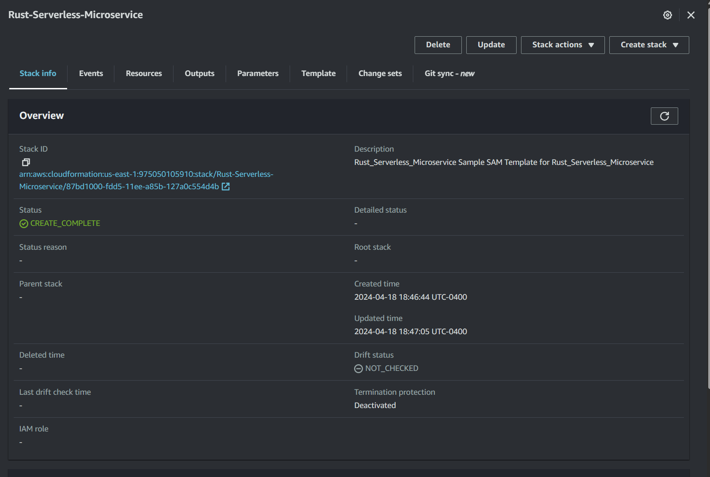
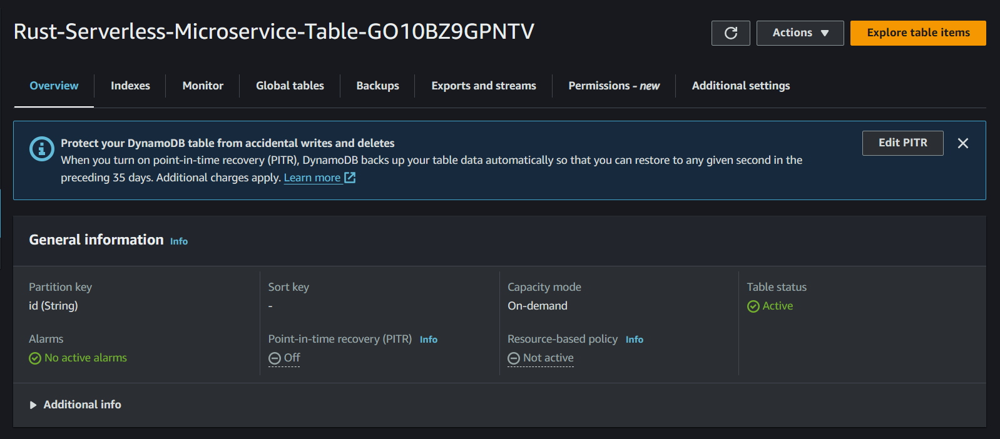
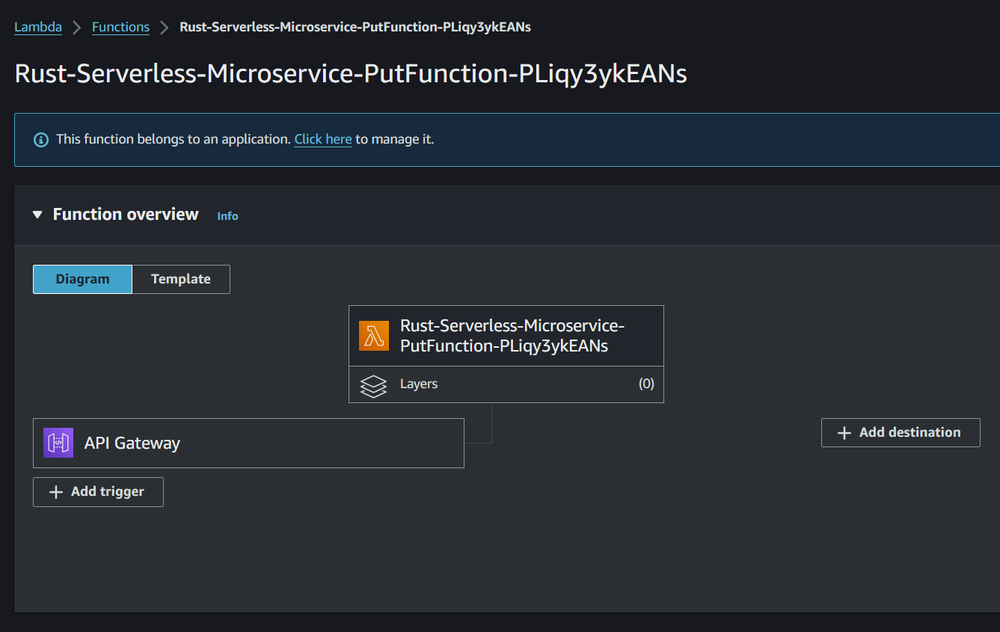

# Rust Microservice with AWS Lambda and DynamoDB

This project is a Rust-based AWS Lambda function that interacts with Amazon DynamoDB to manage student data. It uses the AWS SDK for Rust to interact with AWS services.

## Components

The project consists of several components:

- `main.rs`: This is the main entry point of the application. It sets up the AWS X-Ray client and the Lambda function handler.

- `Request`: This is a struct that represents the incoming request payload. It contains optional fields for `id` and `student_name`.

- `handler`: This is an asynchronous function that handles incoming Lambda events. It deserializes the event payload into a `Request` object, checks if the student exists in the DynamoDB table, and adds the student if they do not exist.

- `add_student`: This is an asynchronous function that adds a new student to the DynamoDB table.

- `check_student`: This is an asynchronous function that checks if a student exists in the DynamoDB table.

## AWS SAM and CloudFormation

This project uses AWS Serverless Application Model (SAM) for building and deploying the Lambda function. AWS SAM is an open-source framework that you can use to build serverless applications on AWS. It simplifies the process of building and deploying Lambda functions and API Gateway.

The `samconfig.toml` file contains the configuration for AWS SAM. It specifies the AWS region, the S3 bucket for deployment artifacts, and other parameters.

When you run `sam build` and `sam deploy`, AWS SAM packages the application, uploads it to the specified S3 bucket, and deploys it using an AWS CloudFormation stack.

## Functionality

When the Lambda function receives an event, it extracts the `id` and `student_name` from the event payload. It then checks if a student with the given `id` exists in the DynamoDB table. If the student does not exist, the function adds a new item to the table with the `id` and `student_name`. If the student already exists, the function does nothing.

## DynamoDB

The Lambda function interacts with a DynamoDB table named `testtable`. It uses the `aws_sdk_dynamodb` crate to send `GetItem` and `PutItem` requests to the table. The `id` field is used as the primary key for the table.

## Getting Started

To build and deploy this project, you need to have AWS SAM and the AWS CLI installed and configured. You also need to have a DynamoDB table named `testtable` in your AWS account.

1. Clone this repository.
2. Run `sam build` to build the Lambda function.
3. Run `sam deploy --guided` to deploy the function. Follow the prompts to specify the stack name and other parameters.
4. Test the function by sending an event with an `id` and `student_name`.

## Creating the Lambda Function

The SAM deployment process creates a new Lambda function in your AWS account. The cloudformation stack creation is shown below

It also creates a dynamoDB table as specified by the serverless application model template.

After following the steps above, you should have a Lambda function deployed in your AWS account as follows:

This function connects to the DynamoDB table and fetches and manipulates data as specified by the rust lambda function.